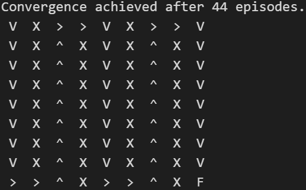

# Q Learning and SARSA Implementation

This project demonstrates the implementation of two reinforcement learning algorithms: Q Learning and SARSA. These algorithms are evaluated across various grid world maps to analyze their performance and behavior.

## Key Concepts

### Q Learning
- **Off-policy Learning**: Q Learning is an off-policy reinforcement learning algorithm, meaning it learns from the actions taken by the optimal policy, rather than the ones it actually follows during training.
- **Q-Value Iteration**: Q Learning updates the Q-values of state-action pairs iteratively based on the Bellman equation, aiming to maximize the total expected reward.
- **Exploration vs. Exploitation**: Q Learning balances exploration of new actions with exploitation of learned knowledge to achieve an optimal policy.

The Bellman equation for Q Learning is:

Q(s, a) = Q(s, a) + α * (r + γ * max_a Q(s', a) - Q(s, a))

### SARSA
- **On-policy Learning**: SARSA (State-Action-Reward-State-Action) is an on-policy reinforcement learning algorithm, which learns and updates Q-values based on the policy it follows during training.
- **TD Learning**: SARSA uses Temporal Difference (TD) learning to estimate the value of state-action pairs, updating Q-values based on the observed rewards and future state-action pairs.
- **Policy Improvement**: SARSA updates its policy based on the Q-values and the exploration strategy, aiming to improve performance while learning.

The Bellman equation for SARSA is:

Q(s, a) = Q(s, a) + α * (r + γ * Q(s', a') - Q(s, a))

## Performance

### Worlds Description

The different worlds have dimensions NxN, and in most cases, the agent starts at the (0,0) coordinate. The target coordinate is represented by the letter 'F', while 'T' represents teleportation points. Additionally, 'X' represents obstacles where the agent can't move. The solution path in the world is represented by arrows indicating the available actions:
- Move down (v)
- Move up (^)
- Move right (>)
- Move left (<)

### Q Learning

#### World 1:
  

#### World Labyrinth:
  

#### CliffWorld:
- In this world, the beginning is at the (3,0) coordinate.
    

### SARSA

#### World 1:
  

#### World Labyrinth:
  

#### CliffWorld:
- In this world, the beginning is at the (3,0) coordinate.
  

### Comparison

Both algorithms achieve great results and manage to find the solution in most cases. However, there are clear differences between SARSA and Q Learning algorithms:

- **Convergence Speed**: Q Learning tends to converge faster than SARSA. This is because Q Learning updates each (s, a) pair with the best possible action, max_a Q(s', a), leading to faster convergence. In contrast, SARSA updates (s, a) with the next actual action (s', a'), leading to a more exploratory and sometimes slower learning process.
- **Risk-Taking**: SARSA takes fewer risks compared to Q Learning. For example, in the CliffWorld map, Q Learning finds the optimal solution near the obstacles, while SARSA tends to take more steps away from the obstacles, making it a more conservative algorithm. This difference arises because SARSA's on-policy nature makes it more cautious in its updates, whereas Q Learning, being off-policy, aggressively pursues the optimal policy.

By comparing the performance of these algorithms across different worlds, we can gain insights into their strengths and weaknesses, and choose the appropriate algorithm based on the specific requirements of the task at hand.
