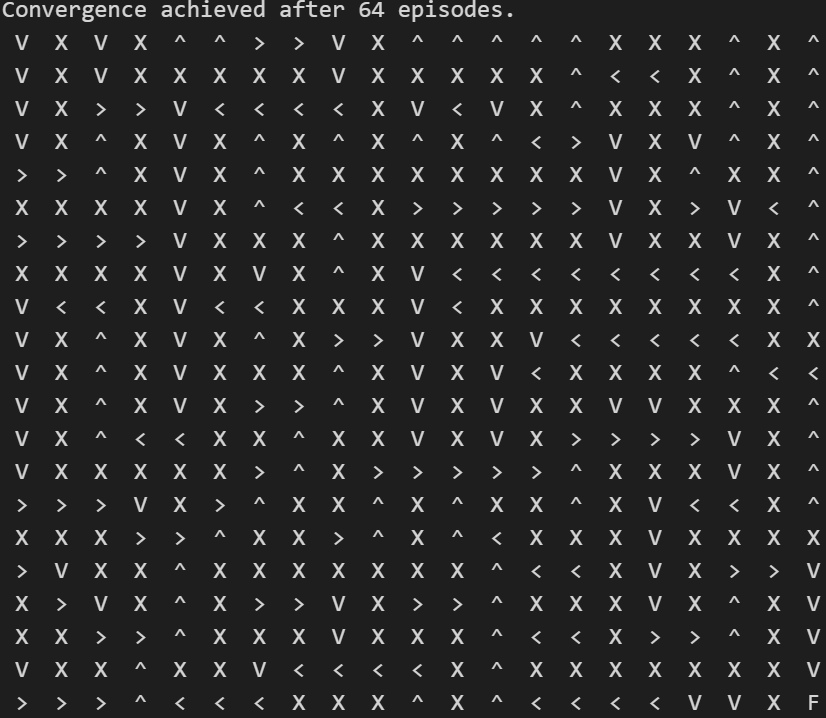
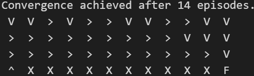
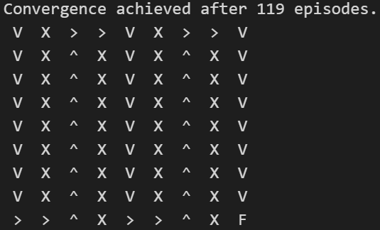
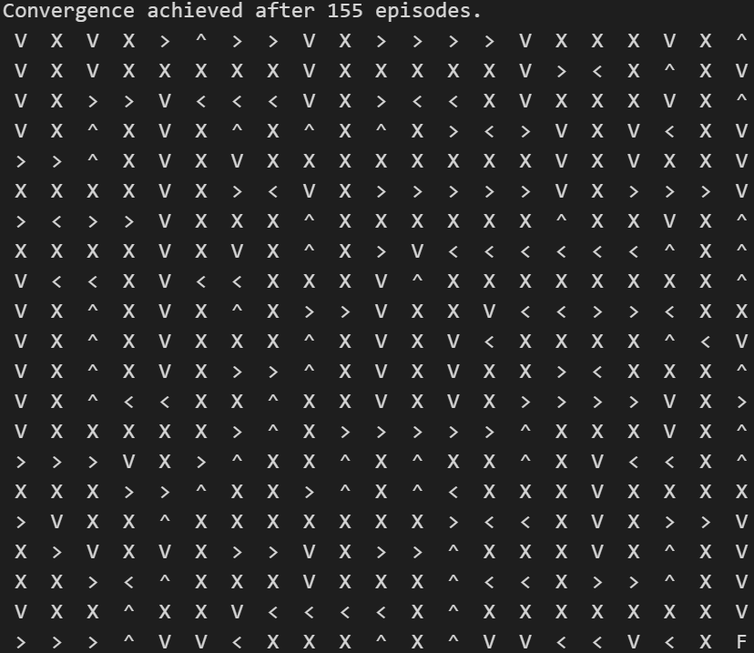
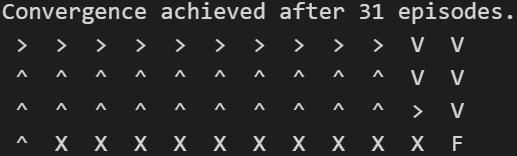

# Q Learning and SARSA Implementation
This project showcases the implementation of two reinforcement learning algorithms: Q Learning and SARSA. These algorithms are evaluated across various grid world maps to analyze their performance and behavior.

## Key Concepts
### Q Learning
- **Off-policy Learning**: Q Learning is an off-policy reinforcement learning algorithm, meaning it learns from the actions taken by the optimal policy, rather than the ones it actually follows during training.
- **Q-Value Iteration**: Q Learning updates the Q-values of state-action pairs iteratively based on the Bellman equation, aiming to maximize the total expected reward.
- **Exploration vs. Exploitation**: Q Learning balances exploration of new actions with exploitation of learned knowledge to achieve optimal policy.

The Bellman equation for Q-learning is:

Q(s, a) = Q(s, a) + α * (r + γ * max_a Q(s', a) - Q(s, a))

### SARSA
- **On-policy Learning**: SARSA (State-Action-Reward-State-Action) is an on-policy reinforcement learning algorithm, which learns and updates Q-values based on the policy it follows during training.
- **TD Learning**: SARSA uses Temporal Difference (TD) learning to estimate the value of state-action pairs, updating Q-values based on the observed rewards and future state-action pairs.
- **Policy Improvement**: SARSA updates its policy based on the Q-values and the exploration strategy, aiming to improve performance while learning.

The Bellman equation for SARSA is:

Q(s, a) = Q(s, a) + α * (r + γ * Q(s', a') - Q(s, a))

### Perforamance

#### Worlds Description

The different worlds have dimensions NxN and in the most cases the agent starts at the (0,0) coordinate and the target coordinate is represented with the letter F, in the other hand the letter T in the maps represent the teletransportation. Additionaly the X represents obtacles where the agent can't move. 
The solution of the world is represented with this arrows and only this acctions are available:
    - move down (v)
    - move up (^)
    - move right (>)
    - move left (<)

#### Q Learning
- World 1:
- 

- World labyrinth:
- 

- CliffWorld:
  - In this world the beggining is at (3,0) coordinate.
    

#### SARSA
- World 1:
  

- World labyrinth:
  

- CliffWorld:
- In this world the beggining is at (3,0) coordinate.
  

#### Comparison

